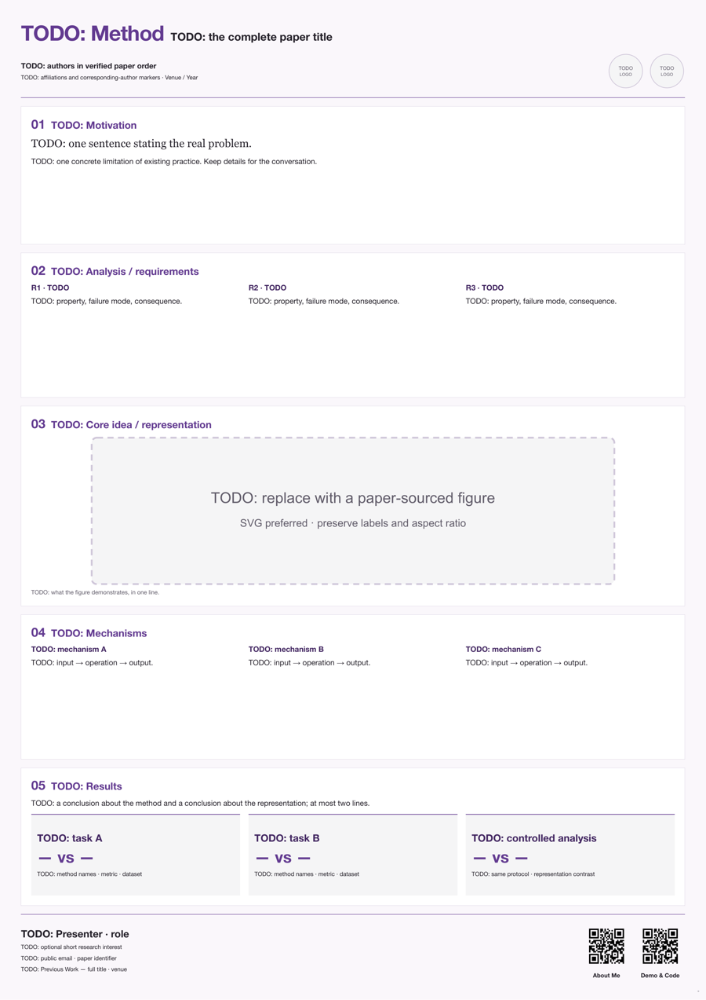
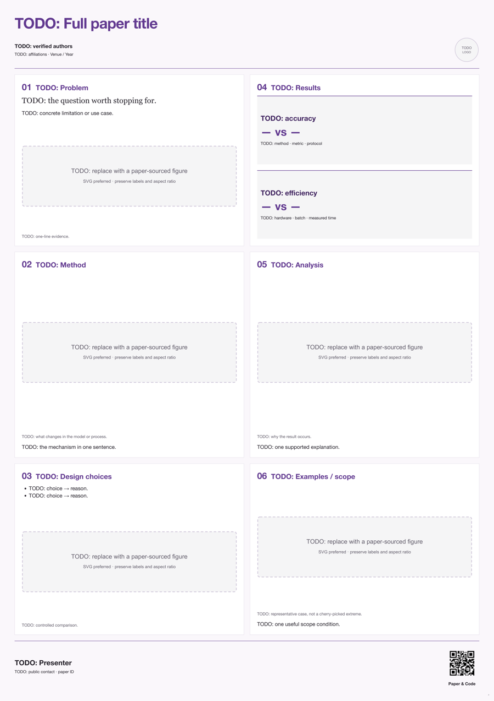
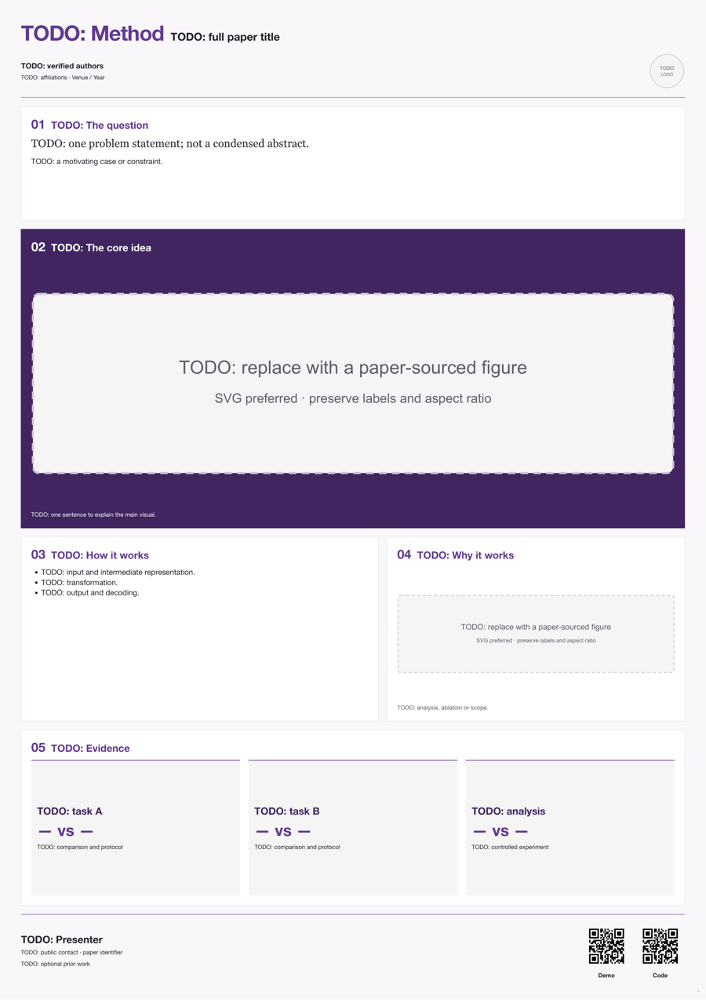

# PosterKit — 本地 HTML 学术海报模板库

这是一套普通文件，不是 skill，也不需要注册到 Codex。把本目录交给任意能编辑文件、运行 Chromium 的助手即可使用。

核心：**论文是证据，HTML 是可编辑画布，localhost 是讨论现场，PDF 是印刷验收对象。**

## 先看版式

打开 `index.html`，或启动本地预览。三种都是 **A0 竖版占位骨架**，不是已填好的论文海报，也不代表任何会议当年的官方尺寸。

| 模板 | 适合什么内容 | 阅读路径 |
|---|---|---|
| `band-story` | 动机、分析和机制值得展开；BeatEdit 这次的叙事方向 | 问题 → 要求 → 核心表达 → 机制 → 结果 |
| `two-column` | 方法与实验证据分量相近，素材较多 | 左栏建立问题和方法，右栏验证与分析 |
| `figure-first` | 一幅图能解释主要贡献 | 问题 → 大主图 → 机制/分析 → 证据 |

紫色只是可替换的初始 token。不要让所有论文都长得一样。三种模板均为 TODO 占位；二维码演示指向 `example.org`，**必须换掉**。

| 顺序叙事 | 双栏 | 主图优先 |
|---|---|---|
|  |  |  |

## 一次安装

在本目录创建独立环境；不要用系统 Python 或 base 环境安装依赖。以下 `python3` 只负责创建环境，后续命令全部使用这个环境。

```bash
python3 -m venv .venv
.venv/bin/python -m pip install -r requirements.txt
.venv/bin/python -m playwright install chromium
```

本机已有可用的独立海报环境时可以复用，不需要重新安装。依赖版本范围见 `requirements.txt`；正式交付可把实际版本锁定在项目自己的环境记录里。

## 五个常用动作

下面均在模板库目录运行；新项目必须放在独立的目录中。

```bash
# 1. 创建。拒绝覆盖已有目录；模板与样例资产不会被原地修改。
.venv/bin/python tools/poster.py init band-story ../MyPaper_Poster

# 2. 修改 MyPaper_Poster/poster.html。预览服务器只绑定本机。
.venv/bin/python tools/poster.py preview --root ../MyPaper_Poster --port 8791
# 打开 http://127.0.0.1:8791/poster.html，修改后刷新。

# 3. 离线生成真正的二维码；不调用在线二维码网站。
.venv/bin/python tools/poster.py qr 'https://example.com/my-paper' ../MyPaper_Poster/assets/paper.svg

# 4. 阶段检查 / 定稿导出。成品不能含 TODO、DEMO 或演示链接。
.venv/bin/python tools/poster.py check ../MyPaper_Poster/poster.html
.venv/bin/python tools/poster.py export ../MyPaper_Poster/poster.html --out ../MyPaper_Poster/final-01 --dpi 300

# 5. 人工确认隐私与内容后，白名单打包，不会上传或推送。
.venv/bin/python tools/poster.py package ../MyPaper_Poster --final ../MyPaper_Poster/final-01 --out ../MyPaper_Poster-delivery.zip --privacy-reviewed
```

模板占位稿试印可加 `check --draft` 或 `export --draft --dpi 72`，但此结果不能当最终交付打包。输出目录与二维码文件也拒绝覆盖；你决定何时保留一个阶段版本，而不是每次微调都生成一份 PDF。

## 内容与流程

- [创作流程](docs/01-workflow.md)：从读论文到交付的六个阶段。
- [本次迭代复盘](docs/02-iteration-lessons.md)：哪些有效，哪些尝试被否决，怎样减少重复操作。
- [组件与排版](docs/03-components.md)：标题、徽章、图、结果卡、联系人与二维码。
- [验收与交付](docs/04-preflight.md)：自动检查边界、印刷检查和隐私检查。
- [可直接复制的任务指令](docs/05-prompts.md)：新建、局部修改、终检。

新建项目会自动获得 `notes/BRIEF.md`、`notes/EVIDENCE.csv`、`notes/DECISIONS.md`。它们只在本地辅助创作，不进最终公开包。

## 边界

本库独立编写了一套轻量工具与中性模板，参考了本次 BeatEdit 迭代和 [Posterly](https://github.com/Chenruishuo/posterly) 的 HTML→Chromium→PDF 思路，未打包其完整 skill 或复制其模板/校验器源码。`check` 是基本几何与资源检查，**不是 Posterly 全套 gates，也不会判断科学结论正确、自动授权图片或替你确认会议规则**。模板保留测量角色，供进一步接入校验工具时调整；不要声称本库报告等价于它的全部门槛。

没有拷贝个人联系方式、真实二维码、签名、证明材料或 BeatEdit 实验数字。工具没有自动外部发布功能。

## 测试

```bash
.venv/bin/python -m unittest discover -s tests -v
# 可选：实际 Chromium → PDF → QR → PNG → zip 集成检查（需要依赖与 Chromium）
POSTERKIT_BROWSER_TESTS=1 .venv/bin/python -m unittest discover -s tests -v
```

模板预览见 `previews/`，是 TODO 骨架的缩略图，不是科研成果或实验结果。所有最终论文内容仍需人工审核。
